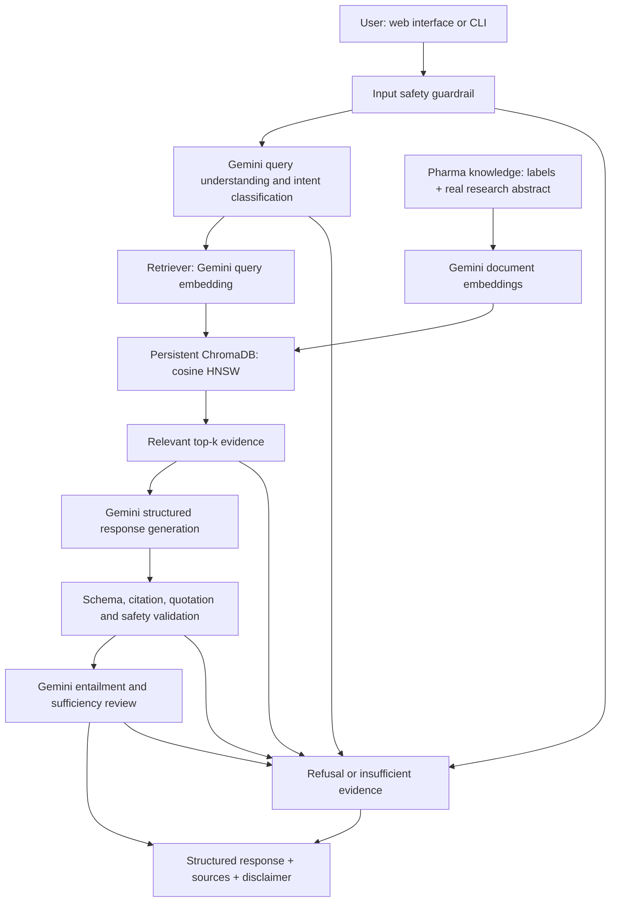

# Pharma Research Assistant — Gemini + ChromaDB

One Pharma research agent with a responsive HTML/CSS/JavaScript frontend and Python backend. It retrieves curated evidence before using Google Gemini to summarize research and identify reported risks or interactions. It does not diagnose, prescribe or make personal treatment decisions.

## Upload PDF, DOCX or TXT documents (no OCR)

The frontend now includes **Add research documents**. Select a file and click **Upload & index**. The backend extracts text, splits it into overlapping chunks, sends extracted text to Gemini for embeddings, and upserts the chunks into a separate persistent Chroma collection. The document appears in **Search in** and is selected automatically; ask about that document or select **All indexed evidence** to search both uploaded documents and the sample corpus.

Supported: text-based PDF with `PyPDFLoader`, DOCX with `Docx2txtLoader`, and UTF-8 TXT with `TextLoader`. `load_document(file_path)` selects the loader by extension. `split_documents(docs)` uses `RecursiveCharacterTextSplitter(chunk_size=700, chunk_overlap=150)`, matching the simple example. Gemini creates embeddings and ChromaDB persists them. No HuggingFace or FAISS is used.

No OCR is installed or run. Image-only PDFs and legacy `.doc` files are unsupported. PDF chunks retain page numbers; DOCX/TXT chunks identify the document and chunk without guessing page numbers. Complex layouts may lose structure and should be checked against the original source.

Limits: 10 MB per file, 200,000 extracted characters and 200 chunks. Files with no extractable text return a clear error. Uploaded documents remain unverified evidence.

Original files and upload metadata are stored under `uploads/`, excluded from Git and the project ZIP. Source references show filename/location and link to a local attachment download. Re-uploading the same file replaces its chunks rather than duplicating them. Gemini receives extracted document text, so upload only documents you intend to process through Gemini. Uploading and indexing requires a working `GEMINI_API_KEY`; there is no fake successful upload mode. File extraction and Chroma persistence have been tested offline with controlled provider embeddings, not with live Gemini.

Uploaded documents can be indexed and searched even before the sample corpus index is built. `python -m pharma index` builds only the sample corpus and preserves uploaded documents. Upload collections are separated by embedding model; after changing the embedding model, re-upload documents to make them searchable with the new model. Original downloads remain available locally. Select an uploaded file in Search in and click Delete selected document. After confirmation, its original file, metadata and chunks across all upload embedding models are removed. Sample knowledge records are preserved. Deletion does not require Gemini access. The local demo does not implement multi-user isolation or a document trust approval workflow.

### Update and run on your computer

Stop the server, replace the source files with the updated ZIP, and preserve your existing `.venv`, `chroma_db` and `uploads` directories if present. In your activated environment run:

```powershell
python -m pip install -r requirements.txt
python -m pharma.web
```

Set `GEMINI_API_KEY` in the terminal or project `.env` file, then restart the server. Open http://127.0.0.1:8000, refresh, choose a document and click **Upload & index**. Wait until it is marked indexed before asking a question. Document loading uses `langchain-community`, `langchain-text-splitters`, `pypdf` and `docx2txt`; their dependencies install automatically. For offline tests that generate DOCX fixtures, install `requirements-dev.txt`.

## Sample knowledge coverage

| Category | Medicines |
|---|---|
| Diabetes | Metformin; Glipizide extended-release |
| Hypertension | Amlodipine; Lisinopril |
| Bone health / osteoporosis | Alendronate |

The corpus contains **15 evidence records from six sources**: five DailyMed labels and one actual research paper. `knowledge/metformin.json`, `expanded.json` and `research.json` are loaded together. [Evidence provenance](knowledge/SOURCES.md) contains source links and section locators. Records are concise paraphrases, not complete prescribing information. The corpus is not an exhaustive or automatically refreshed drug database. Missing evidence must trigger abstention, not an assertion that an interaction does not exist.

Real paper: Knowler WC et al.; Diabetes Prevention Program Research Group. *Reduction in the incidence of type 2 diabetes with lifestyle intervention or metformin.* NEJM 2002;346:393–403. [PubMed PMID 11832527](https://pubmed.ncbi.nlm.nih.gov/11832527/); [DOI 10.1056/NEJMoa012512](https://doi.org/10.1056/NEJMoa012512). Two curated records cover methods/population and results from the published abstract. **This is abstract-based paper summarization, not full-paper ingestion.** The full paper is linked, not redistributed. The population was at high risk without diabetes; these results are not evidence about treating established diabetes or twenty-year mortality.

Evidence quotations in responses are exact excerpts from the curated corpus; they are not necessarily verbatim excerpts of the original source publication. Follow the linked original section for review.

## Setup

Python 3.11 or newer; Windows PowerShell examples:

```powershell
python -m venv .venv
.\.venv\Scripts\Activate.ps1
python -m pip install -r requirements.txt
# Set GEMINI_API_KEY privately in the terminal environment.
# Alternatively put GEMINI_API_KEY in the project .env file; it is loaded automatically.
$env:GEMINI_MODEL = "gemini-3.1-flash-lite"
$env:GEMINI_EMBEDDING_MODEL = "gemini-embedding-001"
python -m pharma index
python -m pharma.web
```

Open http://127.0.0.1:8000. The API key stays on the backend, never in frontend JavaScript. `.env.example` lists settings. Model availability depends on your Google account; generation model is configurable. The embedding adapter uses `gemini-embedding-001` task types; changing to another embedding family can require adapter changes. No GPT or Azure OpenAI integration is included, following the user's explicit selection of Gemini.

Other commands:

```powershell
python -m pharma ask "Summarize the Diabetes Prevention Program paper"
python -m pharma ask "What interaction is reported between alendronate and calcium?"
python -m pharma demo
python -m pharma evaluate
python -m pip install -r requirements-dev.txt
python -m pytest tests -q
```

**Migration:** the old `pharma.sqlite3` is not used. Build a fresh index with `python -m pharma index`. Chroma persists vectors and metadata under `chroma_db/`. This generated directory and API keys are excluded from the deliverable archive. Reindex after changing the corpus or embedding model. The index command requires working Gemini credentials and makes one document embedding request per record.

## Architecture



All application code and tests use ordinary functions, dictionaries and lists. There are no custom classes, inheritance or provider protocols. `provider.py` exposes `connect_gemini`, `embed_text` and `generate_answer`; `retrieval.py` exposes `open_store`, `index_documents`, `add_documents` and `search`. `agent.py` exposes `ask_question`. `domain.py` contains prompts and guardrail patterns. `schema.py` describes JSON fields using dictionaries and validates them with jsonschema. `web.py` connects the frontend to Flask route functions. SDK/library objects are still used as required by those libraries. [Arabic code guide](GUIDE_AR.md) explains each file and the document/question flow.

## ChromaDB and RAG

Use `chromadb.PersistentClient` with an HNSW cosine collection and no automatic embedding function. **Gemini generates both document and query embeddings**; Chroma receives explicit vectors. Document/query task types are `RETRIEVAL_DOCUMENT`/`RETRIEVAL_QUERY`, with 768 dimensions and normalization. Short records are already section-level chunks; the loader rejects oversized records for manual splitting and enforces unique source IDs and required metadata.

All embeddings are generated before publishing an index manifest. Collection names include a corpus/model fingerprint. Changing the corpus creates a new version; old collections remain until explicit maintenance, so failed provider calls do not remove the previous index. An atomic manifest replacement selects the version. This local index command should run separately from requests; concurrent indexing is not supported. The manifest checks corpus fingerprint, record count and dimensions. It is not a general transaction across Chroma and the filesystem.

Chroma returns nearest neighbors and cosine distances. The retriever computes similarity as `1 - distance`, filters by `RETRIEVAL_MIN_SCORE` (default 0.35), and returns at most `RETRIEVAL_TOP_K` (default four) records. HNSW retrieval is approximate. Thresholds are uncalibrated heuristics and require live evaluation. The original question remains available for sufficiency review; model query rewriting does not authorize answering a different question.

## Prompts, structured output and guardrails

The system prompt defines the research role, use of retrieved context, no invented medical facts, evidence versus inference, personal-medical-advice refusal and output schema. Few-shot examples demonstrate a sourced risk, missing evidence and personal treatment refusal. Example source IDs cannot pass actual retrieval citation validation.

Deterministic input checks and Gemini classification supplement each other. Every medical claim has supporting source IDs and exact corpus quotations. Validation rejects unknown IDs, mismatched quotations and certain unsafe treatment instructions. A separate Gemini review checks semantic entailment, safety and whether evidence sufficiently answers the original question. Insufficient evidence yields empty claims. Refusals and disclaimers are not medical decisions. User and retrieved text are treated as untrusted data, including embedded instructions.

Response fields: `topic`, `status`, `summary`, `risks`, `interactions`, `explanation`, `sources`, `confidence`, `disclaimer`. Each claim includes `text` and `evidence`; URLs are taken from source metadata. Confidence is qualitative: `limited_evidence` after successful checks, `none` for abstention/refusal. It is not a medical probability or a guarantee of correctness. A fixed medical disclaimer accompanies every response.

## Design decisions and trade-offs

- ChromaDB is a practical persistent vector database for a local technical demo; it avoids running a separate service and makes the required vector database explicit. It adds dependencies compared with the original custom SQLite vector store.
- Gemini handles query understanding, contextual generation and review. A normal answer uses three generation calls and one query embedding request; this increases cost and latency. Early refusal/abstention reduces calls. The SDK has a 60-second HTTP timeout; failures return an error and no answer.
- Exact quote validation catches invented citations but cannot prove semantic faithfulness. The review model shares failure modes with the answer model; human review remains necessary.
- Five medicines improve coverage while keeping source inspection practical. They do not cover all drugs, all conditions, or all pairwise interactions.
- The real paper is represented by curated abstract records. This preserves a focused auditable demo but cannot answer questions requiring absent full-text details.
- Safety patterns may over-refuse benign queries or miss adversarial phrasing. The app has not been clinically validated.
- The server binds to loopback, uses same-origin JSON requests, rejects cross-origin posts and renders text via `textContent`. This is a local demo server, not production infrastructure.

## Evaluation and demo

`evaluation/cases.json` has **16 live evaluation cases**: research/label summary, metformin risks/interactions/contraindications, missing drugs or interaction partners, unsupported outcomes, personal treatment and prompt injection, plus actual-paper summary and questions for all added medicines. `demo` shows the four required baseline cases; the frontend adds pressure, bone-health and paper examples.

The evaluation reports expected source recall at k, citation/quotation validity, expected answer status, expected content, empty-claim abstention and structured validity. Source recall is a small retrieval-relevance proxy, not precision or a broad benchmark. Exact citations are a grounding proxy, not proof of full semantic faithfulness. No scores are fabricated.

Human review: inspect every claim against its quote and linked publication; check population, numbers, qualification and whether the question was fully supported. Record semantic faithfulness pass/fail and reason. Reports initialize human review as `pending` rather than inventing a judgment. Model variability, source age and limited case coverage restrict interpretation.

Offline tests use real Chroma persistence and controlled embeddings/provider answers. They test retrieval mechanics, grounding and guardrail decisions, schema validation, stale index detection and HTTP behavior. They do **not** measure live Gemini medical accuracy. Live embedding indexing, answers and recorded demo remain pending a privately configured API key. The source package intentionally does not contain fabricated generated answers or a fake live index.

## Scaling and domain adaptability

Future work: current authoritative sources with update tracking, larger source-reviewed evaluations, automatic section extraction, batched embeddings and query caching; use a server-backed Chroma instance for multiple workers. These are plans, not implemented deployment claims. Old index versions need deliberate cleanup after successful migration.

Other industries would replace knowledge records, prompts/examples, output schemas, policy patterns and evaluation cases while reusing provider and retrieval components. Only Pharma is implemented. Multi-agent collaboration and personalization memory are optional bonuses and are not added. The web interface supplies the requested UI bonus.

## Requirement checklist

| Requirement | Status |
|---|---|
| One Pharma agent | Implemented |
| Gemini reasoning | Implemented via official SDK; live access pending API key |
| Real RAG and vector database | Implemented with Gemini embeddings and persistent ChromaDB |
| Sample Pharma knowledge | Five medicines; 15 sourced evidence records |
| Real research paper | Actual NEJM paper, abstract-based methods/results records |
| Prompts and few-shot examples | Implemented |
| Structured output | Plain JSON schemas and local validation |
| Safety and hallucination handling | Input/output checks, citations, review and abstention |
| Confidence/disclaimer | Conservative qualitative label and fixed disclaimer |
| Evaluation approach | 16 cases; automated and human-review procedure |
| Diagram, decisions, trade-offs | Documented above |
| Scaling and domain adaptation | Documented, other domains not built |
| Demo | Commands and frontend examples; live/recorded demonstration pending |
| UI | HTML/CSS/JS connected to Python API |
| Secrets/configuration | Environment or local .env key, configurable models, `.env.example` |

The user selected Gemini despite the original short assignment's GPT/Azure wording. The longer supplied brief also explicitly requires Gemini. This resolves provider choice for this implementation; acceptance of that deviation from the original short brief belongs to the evaluator.

## Technical references

- [Chroma PersistentClient](https://docs.trychroma.com/reference/python/client)
- [Chroma collection configuration](https://docs.trychroma.com/docs/collections/configure)
- [Gemini embeddings](https://ai.google.dev/gemini-api/docs/embeddings)
- [Gemini structured output](https://ai.google.dev/gemini-api/docs/structured-output)

See `VERIFICATION.md` for observed local verification and its limits.
